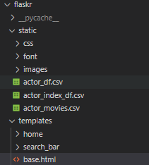

# Ratings On Demand
## Using Machine Learning to Predict IMDb Ratings
#### A Vanderbilt University Data Analytics Final Project

## Overview

Ratings on Demand is a project to predict IMDb movie ratings using features available before a movie’s release like genre, duration, budget, and Oscar nominations. Using datasets provided by [Kaggle](https://www.kaggle.com/stefanoleone992/imdb-extensive-dataset) and data we scraped from IMDb, we created a database on PostgreSQL to hold our data. Using our database and Python, we used several machine learning models such as linear and ridge regression to determine which model provided the most accurate predictions. After collecting all our results, we built a [webpage](https://ratingsondemand.herokuapp.com/) with dashboard-like features to showcase our findings to investors.

## **Links**
- [Heroku Webpage](https://ratingsondemand.herokuapp.com/): Dashboard
- [Trello](https://trello.com/b/jSii2C2y/movies-on-demand): Timeline/Task Management
- [Google Slides](https://docs.google.com/presentation/d/1RqcdU3vLPqZ9CNDki9j3r28mJyeZuCQkzV43hPen5X8/edit#slide=id.gfd8f8070e1_0_106): Presentation Deck

## Why Predicting Audience Ratings Would Matter to Investors

Online ratings are an indispensable part of how we watch movies. They condense an entire feature-length production into a single metric, giving us a measure by which to decide whether it's worthy of our time or not.

Audience Ratings are more than talking points; they influence the viewership of a project. National dialogue regarding movie ratings is often a massive debate topic amongst friends and social media, which may help or hurt a movie's performance at the box office. Some moviegoers go as far as solely relying on movie ratings to determine if they want to invest their time and money before they watch a movie, so investors need to try and predict movie ratings before investing in future projects. 

What weighs more on deciding if a film is good or not: the critics or audience scores? Though our project primarily focused on IMDB audience ratings, the "Eternals" is a recent current event that made national headlines about audience ratings. Moviegoers got caught up in a fierce debate over what scores were more critical on determining if a movie is good or not on Rotten Tomatoes. 

## Questions We Seek To Answer

* Can we accurately predict IMDb ratings with standard movie variables (budget, oscar nominations, directors, genre, etc.)?
  * Is our dataset sufficient enough to produce accurate film ratings? If not, what other means should be explored?
* What correlations, if any, can be drawn between our chosen features and an accurate IMDb rating?
  * Are there any potential patterns that can be used to determine a movie's rating? For example, do movies with summertime release dates involving Oscar award winners play any part in determining a movie's IMDb rating. 
* Which Machine Learning algorithms would provide the most accurate prediction?
  * Is Linear Regression the right approach? If not, what other paths should we consider?  

## Process

#### Step 1 - Establish Timeline & Job Duties:
During our first week of the project, our team got together to decide on a topic. After we agreed on predicting movie scores, we established our communication would be handled via Slack and Zoom. Knowing we only had four weeks to complete the project, we created a timeline and assigned roles using Trello. Check out our Trello timeline [here](https://trello.com/b/jSii2C2y/movies-on-demand).

Every team member contributed to each phase of the project equally, but we assigned leads to each phase to be the expert in that area.
- [Team Lead & Webpage Designer](https://github.com/danielbrock4): Daniel Brock
- [Database Engineer](https://github.com/Emilio-2021): Emilio Castro
- [Machine Learning Expert](https://github.com/sbretag): Scott Bretag
- [Machine Learning Expert](https://github.com/rwalke18): Robert Walker  

#### Step 2 - Clean & Scrape Data:

After reviewing some possible datasets for our project, we decided to go with the Kaggle IMDb movie dataset as our primary data source due to the amount of information related to films, actors, ratings, and the relationship between these datasets.

The Kaggle datasets were also a good option because they would require less cleaning, though we still had to do a bit of ETL before they were ready to put into a database. We needed to collect the MPAA of each movie in our dataset for our models, so we did a little web scraping on the IMDB.com website using BeautifulSoup.

Python and Pandas were our primary tools for cleaning and scraping data. The use of Pandas data frames was essential for our work, which allowed us to select the fields to use from each dataset. We were now able to rename fields with more clear descriptions, check for null values, and merge/join datasets.

#### Step 3 - Set Up Database:

With our data now cleaned, it was time to create our database. But before we could do that, we needed to sketch out our ERD using QuickDBD. This way, we could see visually how our datasets would be connected within our database.

Here is the resulting Database Schema for our project:

Using Amazon Web Services (AWS) Relational Database Services (RDS), we were able to create a new database online where the cleaned and transformed datasets were loaded. Then a connection string to this database was made and distributed to our team for easy access to this resource. Using this new connection to our database, we could now pull cleaned data and tables into Python, where we could use it to build our machine learning models.

#### Step 4 - Machine Learning

The machine learning process and analysis have significant detail, so it's explained in its own section on the README below.  

#### Step 5 - Create Webpage/Dashboard

Initially, our team decided that we wanted to use Tableau to display our results. Still, after careful consideration, we decided we would have more flexibility and design control by building a webpage/dashboard. Sticking with Python being our primary coding language, creating a Flask app to run our webpage/dashboard made the most sense. Heroku provided us a free way to host a webpage for our audience to access our webpage. 

To operate efficiently, while the database and machine learning code were being created and tested, one team member simultaneously made a simple Flask App to test deploying on Heroku. The biggest challenge we faced here was folder structure. Building a web page requires an exact folder structure to operate correctly. 

While we waited for the machine learning code to create our visuals, the webpage was studded, and HTML templates were set up to host our results. Finally, CSS and Bootstrap were used to develop the styling and look to our webpage. 

Once the machine learning code was completed, we added our data and visuals to our web page. Through several trial and error attempts, we finally got Plotly Express to display our visuals.

# Machine Learning Analysis & Results

## Target & Features

#### Target Variable

- IMDB Rating:
  - IMDB ratings are entered by registered IMDb users who can vote from 1-10 on every released title in the IMDB database.  Individual votes are then aggregated as a single IMDB rating, visible on the title's main page.

#### Features & Variables Chosen For Our Machine Learning Models

- **Encoded/Altered Features:**
  - The following features were encoded with dummy variables to convert to numerical values:
    - MPAA Rating:
      - Parental guidance rating (e.g., G, PG, PG-13, R, NC-17)
      - MPAA ratings were not provided by the Kaggle datasets, so the data was scraped using Python and Beautiful Soup.
    - Genres:
      - e.g., Drama, Action, Mystery
      - Most movies are classified with more than one genre. If the film were classified with a genre, the dummy variable would show a 1; if not, 0.
  - The following features were manually encoded during the data cleansing portion of the project:
    - Count of oscar-nominated actors:
      - count of Oscars that were previously nominated at least once.
    - Oscar-nominated director:
      - 1 if the director was previously nominated for oscar or 0 if not.
- **Orignal/Unaltered Features From Original Dataset**:
  - Duration (Minutes)
  - Budget (millions)
  - Title Length
  - Month Released (month #)

## Feature Correlation

We needed to identify any correlations among the features in our dataset. With this knowledge, we may decide to add or reduce features to the datasets used in our machine learning models. 

Per our observations, there were no correlations more robust than 0.50.  In general, correlations between .2 and .5 are considered to have low correlation.  Correlations below .2 are considered to have little to no correlation.  Correlation more significant than .5 has a strong correlation. 
 
The highest correlated features included:
- Duration (Minutes)
- Budget (Millions)
- Count of Oscar Nominated Actors
- Drama genre
- Comedy genre
 
The visualization below shows a correlation matrix filtered with correlations greater than .2 or less than -.2

Given the relatively low correlations, we decided it was best to use all features in our data set for the machine learning models.  Note that we identified multiple independent features that were highly correlated with each other, the risk of multicollinearity was recognized.  

## Machine Learning Model Selection

Given that we are trying to predict a continuous dependent variable from several independent variables, we chose to test 3 different regression models, including:
  - Multiple Linear Regression
  - Ridge Regression
  - XGBoost Regression

Using R-Squared and Mean Absolute Error (MAE), Ridge Regression slightly edged over Linear Regression (as seen below).

Ridge regression is traditionally used to model datasets that suffer from multicollinearity, which we recognized in the feature correlation analysis.  Other important ridge regression features and assumptions include:
  - Utilization of L2 regularization to help prevent multicollinearity
  - The assumptions of Ridge Regression are consistent with Linear Regression except for the distribution of errors to be considered normal, which should not be assumed

## Steps Taken with Ridge Regression Model

- **Assigned X & Y variables:**
  - x = features mentioned above
  - y = IMDb Rating
-  **Train, Test, & Split:**
  - Test Size = 30% of data
  - Random State = 42
- **Rescaled Data:**
  - Utilized standard scaler
- **Fit Model with an Alpha of 10:**
  - The optimal alpha was identified by utilizing the RidgeCV function
- **Generated Predicted Values from Test Values**
- **Created a Scatter Plot to Visualize the Results Using Matplotlib**
- **Generated Diagnostic Plots to Review Model Results, Including:**
  - Regression fit
  - Residual Plot
  - Normal Q-Q plot
- **Created a New Data Frame with Prediction Results Along with the Original Main Data Frame for Further Review and Visualizations**

## Machine Learning Model Results

- R Squared: 0.322
  - Determines how well the model captures the variance in data
- Mean Absolute Error (MAE): 0.596
  - Measures the difference between the measured value and "true" value
- Root Mean Square Error (RMSE): 0.783
  - A measure of how to spread out residuals are or, in other words, how concentrated the data is around the line of best fit

### Actual vs Prediction
 

- Based on the above scatter plot, it appears that most ratings between 5 and 7 can be predicted with relative accuracy shown through the tighter fit
- There appears to be a slight lean towards over predicting ratings in the 3.5-4.5 range, which is the most likely result of the intercept
- Taking a look at some of the more significant errors using the interactive scatter plot found on our website, we identified a few trends
  - Animated films tend to be under-predicted by a vast degree; two examples include  "Up" and "Wall-E."  This potentially indicates we did not have an excellent feature to capture what makes an animated film better than others; further analysis would be needed to confirm
  - Another outlier was the highest prediction the model produced, which appears to be driven by the number of actors with oscar nominations; they had more than any other movie ("Irishman") in our test data, 4 to be exact.  This feels more like a one-off exception however, further analysis and testing would need to be completed; this could potentially mean we need to look at different machine learning models

## Most Important Features

The following features have been ranked by their associated coefficients to show what's most important when predicting IMDB ratings when using this particular model

## Results Summary

Can we accurately predict IMDb ratings with general movie attributes?
  - Based on the MAE, on average, we would be able to predict an IMDB rating within 60 bps +/- of what the actual rating currently is or would be
  - Comparing the RMSE and MAE, the RMSE is approximately 19 bps higher than the MAE, which indicates there are a few large and infrequent errors

Overall, it's not easy predicting human behavior. Still, we believe that an MAE of .596 indicates that we could provide an investor with a decent range of how movie ideas would score in the IMDb rating database.

## Future Considerations to Improve Accuracy

1. Expand award nominations for actors and directions to include Emmy's and Golden Globes.
2. Rather than utilize oscar-nominated directors, use a top 20 list of  movies associated with these directors because our data appears to show a boost in ratings regardless of other features
3. Identify features to predict animated films better. Productions companies might be a good feature to start with
4. Test additional regression models

## **Software:** 
**Languages and Modules**:
 - Python: 
   - Pandas, Numpy, Matplotlib, Collections, BeautifulSoup, Flask, SciPy, SQLalchemy, Plotly, PlotlyExpress
 - HTML/CSS: 
   - Bootstrap 4.0

**DataBase:** 
- PostgreSQL, QuickDBD, AWS

**Technology:** 
- JupyteLab, VS Code, Heroku, Google Slides, Slack, Zoom, Trello

**Algorithms:** 
 - Sklearn: Linear Regression, Ridge Regression
 - XGBoost

## **Data Sources:**

**Raw Data:** 
- [Kaggle](https://www.kaggle.com/stefanoleone992/imdb-extensive-dataset): IMDb movies extensive dataset

**Scraped Data**: 
- [IMDB](https://www.imdb.com/) using BeautifulSoup

